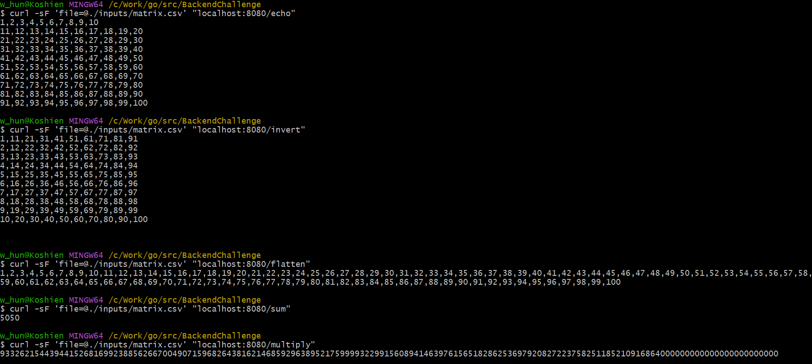

# League Backend Challenge

## Project Overview
In main.go you will find a basic web server written in GoLang. It accepts a single request _/echo_. Extend the webservice with the ability to perform the following operations

Given an uploaded csv file
```
1,2,3
4,5,6
7,8,9
```

1. Echo (given)
    - Return the matrix as a string in matrix format.

    ```
    // Expected output
    1,2,3
    4,5,6
    7,8,9
    ``` 
2. Invert
    - Return the matrix as a string in matrix format where the columns and rows are inverted
    ```
    // Expected output
    1,4,7
    2,5,8
    3,6,9
    ``` 
3. Flatten
    - Return the matrix as a 1 line string, with values separated by commas.
    ```
    // Expected output
    1,2,3,4,5,6,7,8,9
    ``` 
4. Sum
    - Return the sum of the integers in the matrix
    ```
    // Expected output
    45
    ``` 
5. Multiply
    - Return the product of the integers in the matrix
    ```
    // Expected output
    362880
    ``` 

The input file to these functions is a matrix, of any dimension where the number of rows are equal to the number of columns (square). Each value is an integer, and there is no header row. matrix.csv is example valid input.

## Technical Requirement

- The solution runs
- The solution performs all cases correctly
- The code is easy to read
- The code is reasonably documented
- The code is tested
- The code is robust and handles invalid input and provides helpful error messages

## Get Started

- Start the web server
```
go run .
```

- Invoke request
```
curl -sF 'file=@./inputs/matrix.csv' "localhost:8080/echo"
```

## Test

   ```bash
   cd ${application.home}
   go test ./...
   ```

You can also test the API using a tool like Postman or curl.
I've attached postman collection json
[**here**](https://github.com/jazzcowboy616/notesapi/blob/master/src/main/resources/Note%20api.postman_collection.json).

## APIs

The Note API provides the following endpoints:
```
POST /echo          Return the matrix as a string in matrix format.
POST /invert        Return the matrix as a string in matrix format where the columns and rows are inverted
POST /flatten       Return the matrix as a 1 line string, with values separated by commas.
POST /sum           Return the sum of the integers in the matrix
POST /multiply      Return the product of the integers in the matrix
```

## Execution Result



## Some ideas and thought

In terms of the functions of this challenge, they are quite straight forward. Besides the functions, we also need to consider the flexibility and robustness of the application:
- common edge cases
    - non-numeric data
    - invalid format
    - empty file
    - calculation overflow
- uncommon edge
    - very big matrix
    - Non-square matrix

Based on the above consideration, I use the strategies below:
- Use echo framework to support routing to the corresponding API
- Use streaming reading and output with buffered I/O
- Use temporary file to cache the intermediate result
- Algorithmically compatible with non-square matrices
- Use BigInt to support big data calculation and prevent from overflow.
